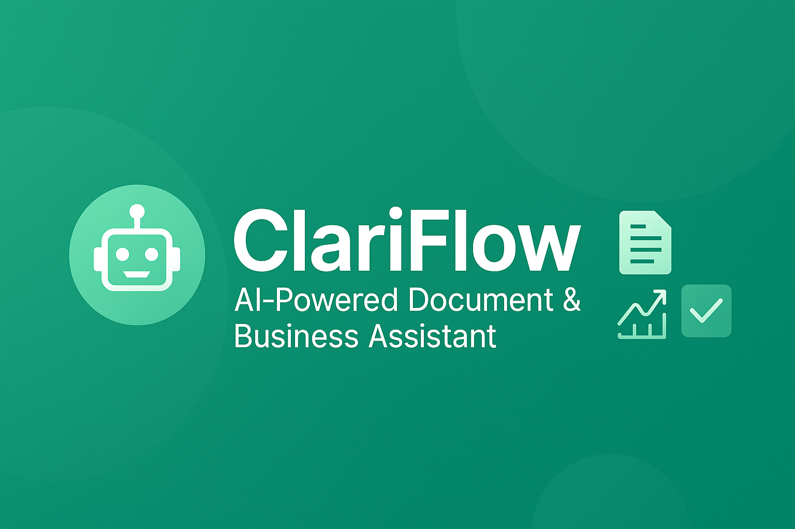

<<<<<<< HEAD
# ClariFlow Frontend

A ChatGPT-like chatbot built with Next.js 14, React 18, and Tailwind CSS.

## Features

### Drag-and-Drop File Upload

The chat interface supports drag-and-drop file upload functionality:

- **Drop Zone**: Users can drag and drop files anywhere on the main chat area
- **Visual Feedback**: A semi-transparent overlay with dashed border appears when dragging files
- **Supported Formats**: PDF (.pdf), Text (.txt), and Word (.docx) files
- **Automatic Upload**: Files are automatically uploaded to the backend `/upload` endpoint
- **Toast Notifications**: Success/error messages are displayed after upload attempts
- **Chat Integration**: Uploaded files are acknowledged in the chat with system messages

### Implementation Details

#### Components

1. **`DragAndDropWrapper`** (`src/components/chat/DragAndDropWrapper.tsx`)
   - Wraps the entire chat area
   - Handles drag-and-drop events
   - Provides visual feedback during drag operations
   - Validates file types before upload

2. **`Chat`** (`src/components/chat/Chat.tsx`)
   - Updated to use `DragAndDropWrapper`
   - Handles file upload logic
   - Displays toast notifications
   - Shows upload status in chat messages

3. **`Toast`** (`src/components/ui/Toast.tsx`)
   - Displays success/error notifications
   - Auto-dismisses after 3 seconds
   - Supports success and error types

#### File Upload Flow

1. User drags a file over the chat area
2. Visual overlay appears with drop instructions
3. On drop, file is validated for supported formats
4. File is uploaded to backend using `POST /upload`
5. Success/error toast is displayed
6. Upload confirmation appears in chat
7. Backend processes file for embeddings

#### API Integration

- Uses `axios` for HTTP requests
- Uploads to `POST /upload` endpoint
- Handles multipart/form-data
- Supports file type validation

## Development

### Prerequisites

- Node.js 18+
- npm or yarn

### Installation

```bash
npm install
```

### Running the Development Server

```bash
npm run dev
```

The application will be available at `http://localhost:3000`.

### Building for Production

```bash
npm run build
npm start
```

## Backend Integration

The frontend expects a FastAPI backend running on `http://localhost:8000` with the following endpoints:

- `POST /upload` - File upload endpoint
- `GET /health` - Health check endpoint

## File Type Support

- **PDF** (.pdf) - `application/pdf`
- **Text** (.txt) - `text/plain`
- **Word** (.docx) - `application/vnd.openxmlformats-officedocument.wordprocessingml.document`

## Project Structure

```
src/
├── app/              # Next.js app directory
├── components/       # React components
│   ├── chat/        # Chat-related components
│   └── layout/      # Layout components
├── lib/             # Utility functions and API client
└── styles/          # Global styles
```

## Development

- `npm run dev` - Start development server
- `npm run build` - Build for production
- `npm run start` - Start production server
- `npm run lint` - Run ESLint
- `npm run type-check` - Run TypeScript compiler

## Contributing

1. Fork the repository
2. Create your feature branch
3. Commit your changes
4. Push to the branch
5. Create a Pull Request
=======
<p align="center">
  
</p>


# 🤖 ClariFlow – AI-Powered Document & Business Assistant

ClariFlow is not just a chatbot — it's an evolving **AI workspace assistant** that helps users interact with documents, spreadsheets, leads, tasks, and meetings using natural language. Built using **Cursor AI**, **LangChain**, **OpenAI**, and a full-stack architecture, ClariFlow is your command center for data-driven decision-making and productivity.

---

## 💼 Core Use Cases

| Role         | Use ClariFlow to...                                                    |
|--------------|-------------------------------------------------------------------------|
| ✅ Solopreneurs | Upload proposals → auto summarize → write client emails                |
| ✅ Agencies      | Chat with campaign data → generate insights → send follow-ups         |
| ✅ Sales teams   | Analyze lead CSVs → auto-generate emails → set reminders              |
| ✅ Analysts      | Ask questions over Excel/CSV → get text + visual answers              |
| ✅ Product teams | Upload meeting audio → get summary → extract tasks                    |

---

## 🔍 Feature Overview

| Phase                            | Features                                                   | Status        |
|----------------------------------|------------------------------------------------------------|----------------|
| **1. Chat with Files**           | Upload → Embed → Ask questions with GPT                    | ✅ Done        |
| **2. Spreadsheet Q&A & Charts**  | Ask Excel questions → Auto-analyze → Show trends/charts    | 🛠️ In Progress |
| **3. Meeting Summarizer**        | Upload audio → Transcribe → Extract tasks                   | 🔜 Coming Soon |
| **4. CRM & Lead Follow-ups**     | Generate follow-up emails → Set reminders                   | 🔜 Coming Soon |
| **5. Team + Workspace Sync**     | Task assignment → Notion export → Daily chat reports        | 🔜 Roadmap     |

---

## 🧠 Key Modules

### 📁 1. File Upload + Chunking
- Supports PDF, DOCX, TXT uploads
- LangChain handles text chunking
- Embeddings stored via ChromaDB

### 💬 2. AI Chat Interface
- Realtime, ChatGPT-style UI
- Context-aware conversation using LangChain memory
- Google login & session-based history

### 📊 3. Spreadsheet BI Analyzer
- Upload CSV or Excel
- Ask questions like:
  > "Compare Q1 vs Q2 revenue by region"  
  > "Top 5 products this month?"
- Output = Insights + Auto-generated charts (Recharts or Plotly)

### 🎙️ 4. Meeting Summary Bot
- Upload `.mp3` → Transcribe with Whisper
- Auto-detect key actions, decisions, and tasks
- Export summaries to Notion or ClickUp

### ✉️ 5. Email & CRM Assistant
- Auto-generate client follow-ups, outreach emails
- Integrate with Airtable/HubSpot
- Smart reminders & pipeline insights

---

## 🛠️ Tech Stack

| Layer        | Tech Used                            |
|--------------|---------------------------------------|
| Frontend     | Next.js 14, Tailwind CSS, TypeScript |
| Backend      | FastAPI, Python                      |
| AI/LLM       | OpenAI GPT-4, LangChain              |
| Vector Store | ChromaDB                             |
| Orchestration| Cursor AI Agents                     |
| Auth         | Google OAuth 2.0                     |
| Extras       | Whisper, Recharts, Railway           |

---

## 📈 Competitive Edge

| Tool         | Limitation               | ClariFlow Wins With...                        |
|--------------|--------------------------|-----------------------------------------------|
| ChatGPT      | No doc or task context   | Full doc+spreadsheet+task intelligence        |
| Notion AI    | Text-only assistant      | Integrations + workflow + BI charts           |
| Fireflies    | Meeting summary only     | Summary + task + follow-up generation         |
| Clay/Apollo  | Just leads               | Leads + actions + insights + automation       |

---

## 📬 Contact

Built by **Kandizz**  
🎓 BCA 2nd Year, Jamia Hamdard University  
📧 kandizz1947@email.com  
🔗 [GitHub](https://github.com/Kaandizz) |

---

> 🧠 ClariFlow isn't just a chatbot — it's a **modular AI command center** that turns your content, conversations, and data into action.

>>>>>>> ef8e395589e7caea9527aee87aa8a92fcad3b63e
